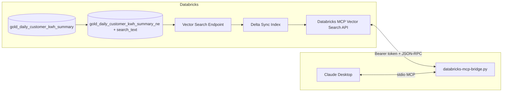

# Databricks Vector Search MCP — Energy Data & Claude Desktop


This project demonstrates an end-to-end **Model Context Protocol (MCP)** setup: **customer energy (kWh) data** in Databricks is embedded and indexed with **Databricks Vector Search**, exposed through **Databricks’ hosted MCP Vector Search API**, and consumed from **Claude Desktop**—either directly via the hosted URL or through a local **stdio bridge** that authenticates with Azure AD or a personal access token (PAT).

---

## What you get

| Layer | Role |
|--------|------|
| **Gold table** | Daily per-customer kWh, cost, plan, geography (`gold_daily_customer_kwh_summary`) |
| **Enriched table** | `search_text` column built from names, location, plan, usage band, cost, date |
| **Vector Search** | Delta Sync index on `search_text` with `databricks-bge-large-en` embeddings |
| **Databricks MCP** | JSON-RPC `tools/call` endpoint that runs similarity search over the index |
| **Claude Desktop** | Uses the MCP tool to answer natural-language questions about energy usage patterns |

---

## Architecture



- **Hosted MCP URL** (from workspace):  
  `https://<workspace-host>/api/2.0/mcp/vector-search/<catalog>/<mcp_server_name>`
- **Tool name** (Unity Catalog index):  
  `<catalog>__<schema>__<index_name>`  
  Example: `na-dbxtraining__biju_gold__customer_kwh_embeddingsindex`

The included **`databricks-mcp-bridge.py`** implements an MCP server on **stdin/stdout** that forwards `tools/call` to that URL with a **Bearer token** from Azure AD (service principal) or `DATABRICKS_TOKEN` (PAT).

---

## Prerequisites

- Databricks workspace with **Unity Catalog**, **Vector Search**, and permissions to create endpoints and indexes
- Python **3.10+** on the machine running the bridge (for Claude Desktop local MCP)
- For the bridge: either  
  - **Azure AD app registration** (client ID, secret, tenant) with access to the workspace, or  
  - a **Databricks PAT** with access to the Vector Search MCP APIs

---

## Part 1 — Data & Vector Search (Databricks notebook)

Run the steps in `mcp-energy-vectorsearch .ipynb` in a Databricks notebook. Summary:

1. **Source data** — Query `na-dbxtraining.biju_gold.gold_daily_customer_kwh_summary` (daily customer kWh and related fields).

2. **Working table** — Copy to e.g. `gold_daily_customer_kwh_summary_ne` and populate **`search_text`** by concatenating customer name, city/state, plan, usage tier (high/medium/low from `total_kwh_daily`), cost, rate, and reading date.

3. **Change Data Feed** — `ALTER TABLE ... SET TBLPROPERTIES ('delta.enableChangeDataFeed' = 'true')` for sync with the index.

4. **Packages** — `pip install databricks-vectorsearch` (in the cluster/notebook).

5. **Endpoint** — Create a **STANDARD** Vector Search endpoint (e.g. `customer_kwh_endpoint`).

6. **Index** — `create_delta_sync_index` with:
   - `primary_key`: `record_id`
   - `embedding_source_column`: `search_text`
   - `embedding_model_endpoint_name`: `databricks-bge-large-en`
   - `pipeline_type`: `TRIGGERED` (as in the sample)

7. **Validate** — `similarity_search` with a natural-language query (e.g. “high energy usage customer in California”).

8. **MCP URL & tool name** — From catalog, schema, index, and workspace host:

   - `MCP_SERVER_URL` =  
     `https://<DATABRICKS_HOST>/api/2.0/mcp/vector-search/<CATALOG>/<MCP_SERVER_NAME>`  
     where `<MCP_SERVER_NAME>` matches your **MCP server name** in Unity Catalog (example uses schema-level name `biju_gold`).
   - `MCP_TOOL_NAME` = `<CATALOG>__<SCHEMA>__<INDEX_NAME>`  
     (index name without catalog/schema in the last segment—see your notebook output).

Replace placeholders with your workspace values when you fork this demo.

---

## Part 2 — Environment variables (local bridge)

Create a `.env` file next to `databricks-mcp-bridge.py` (do not commit secrets).

**Option A — Azure service principal (recommended in code comments)**

| Variable | Description |
|----------|-------------|
| `DATABRICKS_CLIENT_ID` | Azure AD application (client) ID (or `ARM_CLIENT_ID`) |
| `DATABRICKS_CLIENT_SECRET` | Client secret (or `ARM_CLIENT_SECRET`) |
| `DATABRICKS_TENANT_ID` | Directory tenant ID (or `ARM_TENANT_ID`) |

**Option B — PAT**

| Variable | Description |
|----------|-------------|
| `DATABRICKS_TOKEN` | Databricks personal access token |

**Optional overrides**

| Variable | Description |
|----------|-------------|
| `DATABRICKS_HOST` | Workspace URL, e.g. `https://adb-xxxx.azuredatabricks.net` |
| `MCP_SERVER_URL` | Full MCP Vector Search URL (see Part 1) |
| `MCP_TOOL_NAME` | Full tool name `catalog__schema__index` |

---

## Part 3 — Claude Desktop

### Option A — Local MCP bridge (stdio)

Claude Desktop launches the bridge as a subprocess and talks MCP over stdin/stdout. The bridge obtains a token and calls the Databricks MCP endpoint.

Add to **Claude Desktop** config (macOS: `~/Library/Application Support/Claude/claude_desktop_config.json`; merge with your existing `mcpServers`):

```json
{
  "mcpServers": {
    "databricks-energy-vectorsearch": {
      "command": "python3",
      "args": [
        "/absolute/path/to/databricks-mcp-bridge.py"
      ],
      "env": {
        "DATABRICKS_CLIENT_ID": "your-client-id",
        "DATABRICKS_CLIENT_SECRET": "your-secret",
        "DATABRICKS_TENANT_ID": "your-tenant-id",
        "DATABRICKS_HOST": "https://adb-xxxx.13.azuredatabricks.net",
        "MCP_SERVER_URL": "https://adb-xxxx.13.azuredatabricks.net/api/2.0/mcp/vector-search/na-dbxtraining/biju_gold",
        "MCP_TOOL_NAME": "na-dbxtraining__biju_gold__customer_kwh_embeddingsindex"
      }
    }
  }
}
```

You can rely on `.env` instead of inline `env` if the process working directory and file layout match; inline `env` is explicit for Claude Desktop.

Restart Claude Desktop after editing the config.

**Tool exposed to Claude:** `na-dbxtraining__biju_gold__customer_kwh_embeddingsindex` — *“Search customer energy consumption data using vector similarity”* with a single required argument: `query` (string).

### Option B — Hosted MCP URL (`type: url`)

Your notebook prints a URL-based snippet:

```json
{
  "mcpServers": {
    "biju_gold": {
      "type": "url",
      "url": "https://<DATABRICKS_HOST>/api/2.0/mcp/vector-search/<CATALOG>/<MCP_SERVER_NAME>",
      "name": "biju_gold"
    }
  }
}
```

Whether this works as-is depends on **Claude Desktop’s support for URL transports** and **Databricks authentication** for browser/desktop clients. If the app cannot attach a Bearer token or complete OAuth for your workspace, use **Option A (bridge)**.

---

## Quick test (CLI)

With `.env` loaded or variables exported:

```bash
python3 databricks-mcp-bridge.py "customers with high daily kWh in California"
```

This prints JSON search results (token acquisition + `tools/call` to the configured MCP URL).

Debug logs for **stdio MCP mode** go to `/tmp/databricks-mcp-bridge.log`.

---

## Example prompts in Claude

After the connector is active, you can ask:

- “Which customers look like high energy usage in Texas?”
- “Summarize plans associated with medium daily kWh.”
- “Find records similar to expensive weekend tariff usage last week.”

Claude will use the vector tool to retrieve relevant rows; answers depend on indexed columns and your `search_text` design.

---

## Files in this repo

| File | Purpose |
|------|---------|
| `databricks-mcp-bridge.py` | Azure AD or PAT auth; `call_mcp_tool`; stdio MCP server for Claude Desktop |
| `mcp-energy-vectorsearch .ipynb` | Databricks steps: table prep, Vector Search index, MCP URL/tool name |
| `.env` | Local secrets (not committed)—template described in Part 2 |

---

## Security notes

- Treat **client secrets** and **PATs** like production credentials; rotate regularly.
- Scope the Azure AD app and Unity Catalog grants to the minimum catalog/schema needed.
- Prefer **service principal** over shared PATs for automation and auditability.

---

## References

- [Databricks Vector Search](https://docs.databricks.com/en/generative-ai/vector-search.html)
- [Model Context Protocol](https://modelcontextprotocol.io/)
- Databricks workspace URL pattern: `https://adb-<workspace-id>.<random>.azuredatabricks.net`

This README matches the implementation in `databricks-mcp-bridge.py` and the notebook workflow for **energy (kWh) customer data** and **Claude Desktop** consumption.
